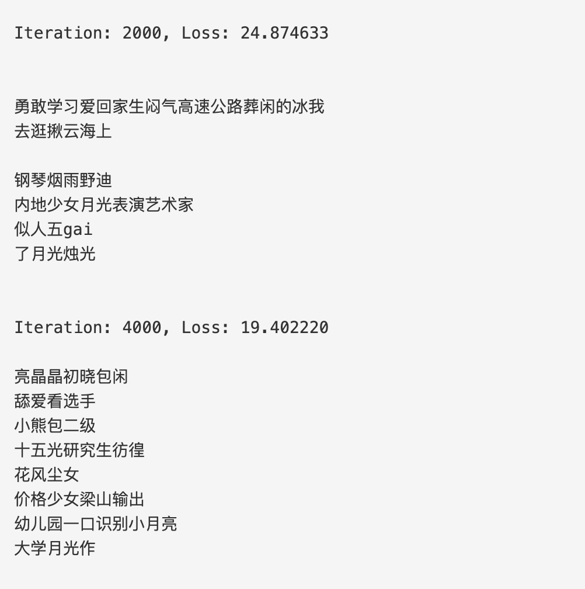
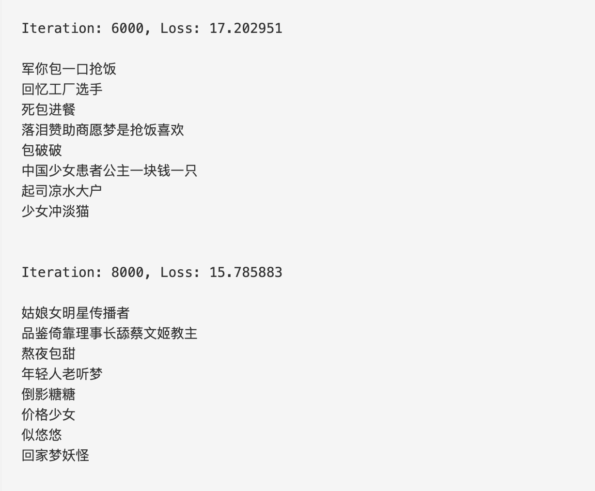
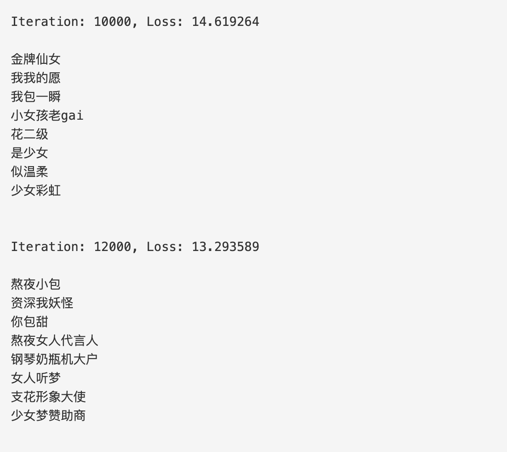
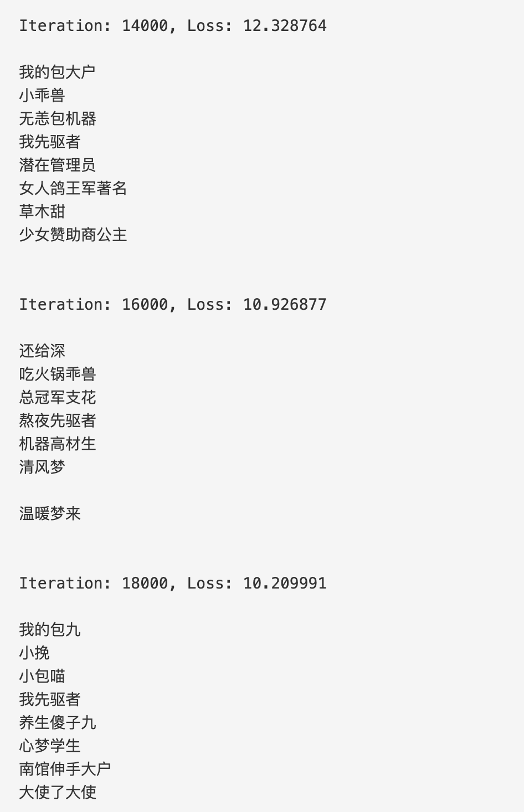

# nicknameGenerator

想换一个有趣又沙雕的网名，绞尽脑汁也找不到喜欢的，正好最近在coursera上学习吴恩达的深度学习系列课程《 Sequence Models》，仿照其中的一个作业做了一个RNN中文网名生成器。

### 数据
网上收集了210个中文网名，部分训练数据如下如下：

使用jieba分词对训练样本进行处理，一共得到504个中文词汇。

### RNN模型

图片来源于吴恩达《Sequence Models》课程
在每一个时间片，RNN根据前面得到的词汇预测下一个词汇， $X = (x^{\langle 1 \rangle}, x^{\langle 2 \rangle}, ..., x^{\langle T_x \rangle})$ 是对样本分词后得到的词列表，并且每一个时间片的输出等于下一个时间片的输入，即 $y^{\langle t \rangle} = x^{\langle t+1 \rangle}$ 。
一个RNN cell的计算公式如下：
$$a^{\langle t+1 \rangle} = \tanh(W_{ax}  x^{\langle t \rangle } + W_{aa} a^{\langle t \rangle } + b)\tag{1}$$
$$z^{\langle t + 1 \rangle } = W_{ya}  a^{\langle t + 1 \rangle } + b_y \tag{2}$$
$$\hat{y}^{\langle t+1 \rangle } = softmax(z^{\langle t + 1 \rangle })\tag{3}$$

### 算法流程
#### 初始化参数
#### 对于每一轮迭代
1. 向前传播计算loss函数
2. 反向传播计算梯度
3. 对梯度进行处理防止梯度爆炸
4. 利用梯度对参数进行更新

每经过2000次迭代进行一次采样输出。

### 运行结果

第0次迭代

2000和4000次迭代

6000和8000次迭代

10000和12000次迭代

14000、16000和18000次迭代

20000、22000和24000次迭代

